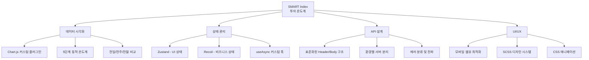

# 📊 SMART Index 투자 온도계 — 포트폴리오 정리

## 프로젝트 개요

| 항목 | 내용 |
|------|------|
| **프로젝트명** | SMART Index 금융시장 투자 온도계 |
| **클라이언트** | 하나은행 × 콴텍(Quantec) |
| **서비스 목적** | AI 알고리즘 기반 실시간 금융 시장 변동성 분석 및 투자 위험도 시각화 |
| **대상 시장** | S&P 500, NASDAQ |
| **기술 스택** | React 18, Chart.js 4, Zustand, Recoil, styled-components, SCSS, React Router v6 |

---

## 🔥 포트폴리오에서 강조할 핵심 포인트

### 1. 금융 도메인 데이터 시각화

> 콴텍의 AI 알고리즘이 산출한 SMART Index를 **5단계 온도계**(냉각 → 공포 → 안정 → 상승 → 과열)로 시각화하는 핵심 UI를 개발했습니다.

- 0~100 범위의 지수를 **5단계 구간**(0~20, 21~40, 41~60, 61~80, 81~100)으로 매핑
- 각 구간별 **고유 컬러 테마** 적용 (`#83B3DE` 냉각 ~ `#F28B8B` 과열)
- 구간별 **SVG 아이콘, 배경색, 설명 문구** 동적 변경
- 전일/전주/전월 비교 온도를 함께 표시하여 **추세 파악** 지원

```
📁 관련 파일
├── src/components/Temper.js     ← 5단계 온도계 컴포넌트 (STEPTEMPER 상수 + UI)
├── src/pages/Hana/HanaMn.js     ← 메인 대시보드 페이지
└── src/img/SvgStore.js          ← SVG 아이콘 관리
```

---

### 2. Chart.js 커스텀 플러그인 개발

> Chart.js의 **Plugin API**를 활용하여 커스텀 배경 이미지 렌더링 플러그인을 직접 구현했습니다.

- `beforeDraw` 훅에서 **Canvas 2D Context**에 직접 배경 이미지 렌더링
- 차트 영역(`chartArea`) 좌표 계산을 통한 **정밀 위치 조정**
- 이미지 로딩 상태를 감지하여 **비동기 렌더링** 처리 (`image.onload → chart.draw()`)
- 온도 구간별 **동적 색상 변경** 바 차트 구현 (borderRadius: `Number.MAX_VALUE`로 둥근 모서리)

```javascript
// 커스텀 플러그인 핵심 코드
const plugin = {
  id: "customCanvasBackgroundImage",
  beforeDraw: (chart) => {
    const ctx = chart.ctx;
    const { top, left } = chart.chartArea;
    ctx.drawImage(image, left + 11.2, top - 5);
  },
};
```

---

### 3. 커스텀 비동기 데이터 패칭 Hook (`useAsync`)

> `useReducer` 패턴과 Recoil을 결합한 **커스텀 훅**을 설계하여 API 호출의 상태 관리를 표준화했습니다.

- **4가지 상태** 관리: `LOADING` → `SUCCESS` / `INTERNAL_ERROR` / `ERROR`
- 서버 응답 코드(`resultCode`)에 따른 **분기 처리** (정상 `0000` vs 서버 내부 오류)
- 네트워크 오류와 서버 로직 오류를 **분리하여 Recoil 전역 상태로 전파**
- `skip` 파라미터로 **조건부 실행** 지원
- 재시도를 위한 `fetchData` 함수 반환

```
장점: API 호출 시 반복되는 보일러플레이트 코드를 제거하고,
에러 핸들링을 중앙 집중화하여 유지보수성 향상
```

---

### 4. 이중 상태 관리 아키텍처 (Zustand + Recoil)

> 상태의 성격에 따라 **두 가지 상태 관리 라이브러리**를 전략적으로 분리 적용했습니다.

| 라이브러리 | 용도 | 예시 |
|-----------|------|------|
| **Zustand** | UI 로컬 상태 (팝업 열기/닫기 등) | `PopupStore.js` — 팝업 표시 여부, 팝업 콘텐츠 인덱스 |
| **Recoil** | 비즈니스 전역 상태 (에러, 전략 데이터 등) | 네트워크 에러, 서버 내부 에러, 전략 리스트, 차트 데이터, 리밸런싱 데이터 |

```
📁 상태 관리 구조
├── src/Store/PopupStore.js          ← Zustand (UI 상태)
├── src/Store/Store.js               ← Recoil atoms (비즈니스 상태)
└── src/recoil/atoms/
    ├── networkError.js              ← 네트워크 에러 상태
    ├── internalCoreError.js         ← 서버 내부 에러 상태
    ├── joinEvent.js                 ← 사용자 참여 이벤트 상태
    └── user.js                      ← 사용자 정보 상태
```

---

### 5. RESTful API 추상화 레이어

> Header/Body 구조의 **표준화된 API 통신 레이어**를 설계하여 모든 API 호출을 일관되게 처리합니다.

- `makeHeader(tr, uid)` — 트랜잭션 코드 기반 헤더 생성
- `makeFetchOption(header, body)` — POST 요청 옵션 자동 구성
- 환경별 서버 URL 분리 (DEV / PROD / TEST / LOCAL / IRA)
- 트랜잭션 코드 기반 API 식별 체계 (`1001` 홈, `1002` 차트, `9000~9006` 전략 조회)

---

### 6. 모바일 최적화 금융 서비스 UI/UX

> 하나은행 모바일 앱 내 **웹뷰 환경**에 최적화된 반응형 금융 서비스 UI를 구현했습니다.

- **max-width 400px** 모바일 퍼스트 디자인
- SCSS 기반 **체계적인 스타일 시스템** (변수, 네스팅, 믹스인 활용)
- **CSS 애니메이션** 기반 커스텀 로딩 인디케이터 (12개 도트 순차 애니메이션)
- 팝업 오픈 시 **스크롤/터치 잠금** 처리 (`overflow: hidden`, `touch-action: none`)
- Tab 형태의 **S&P500 / NASDAQ 전환** UI
- SVG 기반 **구간별 설명 인포그래픽** 팝업

---

### 7. 컴포넌트 기반 설계

> 재사용 가능한 **컴포넌트 단위**로 UI를 분리하여 유지보수성과 확장성을 확보했습니다.

| 컴포넌트 | 역할 |
|---------|------|
| `Temper` | 5단계 온도계 시각화 (메인 컴포넌트) |
| `Title` | 섹션별 타이틀 + 기준일 표시 |
| `Popup` / `POPUP` | 풀스크린 팝업 (투자 온도 활용법, 콴텍 소개) |
| `PopupBtn` | 팝업 트리거 버튼 그룹 |
| `Loading` | CSS 애니메이션 기반 로딩 인디케이터 |
| `Notice` | 유의사항/면책 조항 |
| `Layout` | React Router Outlet 기반 레이아웃 |

---

## 🛠 기술적 어필 포인트 요약



---

## 💡 포트폴리오 작성 시 추천 표현

1. **"금융 AI 기업(콴텍)과 하나은행의 B2B 협업 프로젝트에서 프론트엔드를 담당"**
2. **"AI가 산출한 투자 위험도 지수를 직관적인 온도계 UI로 시각화"**
3. **"Chart.js Plugin API를 활용한 커스텀 차트 배경 렌더링"**
4. **"Zustand + Recoil 이중 상태 관리 아키텍처 설계"**
5. **"useReducer 기반 커스텀 비동기 Hook으로 API 통신 표준화"**
6. **"하나은행 모바일 앱 웹뷰에 최적화된 반응형 금융 UI 구현"**
